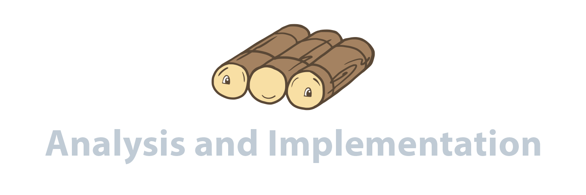

 

  
  <h3 align="center">RAFT Analysis and Implementation</h3>
  
Protocol overview, implementation and performance analysis

  
Table of Contents

  <ol>
    <li>
      <a href="#about-the-project">About The Project</a>
    </li>
    <li><a href="#raft-overview">RAFT Overview</a></li>
      <ul>
        <li><a href="#leader-election">Leader Election</a></li>
        <li><a href="#log-replication">Log Replication</a></li>
        <li><a href="#state-machine">State Machine</a></li>
      </ul>
    <li><a href="#implementation">Implementation</a></li>
      <ul>
        <li><a href="#client">Client</a></li>
        <li><a href="#state-machine-loop">State Machine Loop</a></li>
        <li><a href="#update-state-machine">State Machine Updates</a></li>
            <ul>
              <li><a href="#leader">Leader</a></li>
              <li><a href="#candidate">Candidate</a></li>
              <li><a href="#follower">Follower</a></li>
            </ul>
        <li><a href="#interface">Interface</a></li>
      </ul>
    <li><a href="#results">Results and Performance Analysis</a></li>
      <ul>
        <li><a href="#latency">Latency</a></li>
        <li><a href="#election-time">Election Time</a></li>
        <li><a href="#convergence-time">Convergence Time</a></li>
      </ul>
    <li><a href="#general-review">General Review</a></li>
    <li><a href="#contact">Contact</a></li>
  </ol>

## About The Project

This project aims to explain what RAFT is about, describe a possible implementation using Java, provide real data regarding the usage of 3, 5 and 7 servers and discuss its performance corcerning the obtained results.
Furthermore, the implementation's source code is also available.

## RAFT Overview

### Leader Election

### Log Replication

### State Machine

## Implementation

### Client

### State Machine Loop

### State Machine Updates

#### Leader

#### Candidate

#### Follower

### Interface

## Results and Analysis

### Latency

### Election Time

### Convergence Time

## General Review

## Contact

André Aragão - [@andreribeiroaragao](https://www.linkedin.com/in/andreribeiroaragao/) - up201606535@fe.up.pt

André Matos - [@andre-matos98](https://www.linkedin.com/in/andre-matos98/) - up201606326@fe.up.pt

Margarida Marques - [@margarida-marques-b65618162/](https://www.linkedin.com/in/margarida-marques-b65618162/) - up201603208@fe.up.pt
